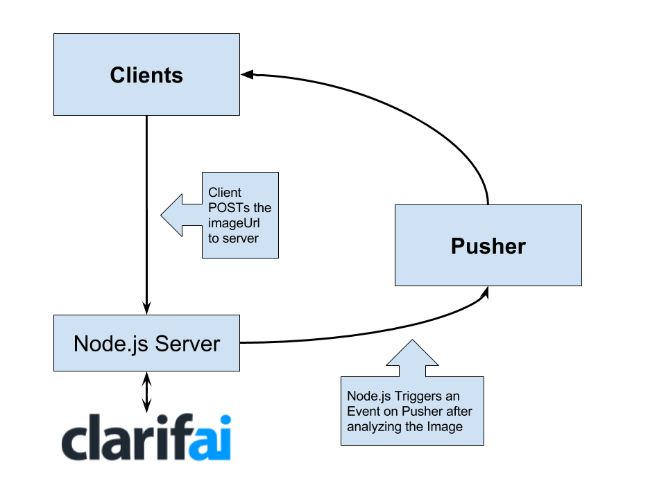

# Realtime AI Moderation application with [Clarifai](https://clarifai.com) and [Pusher](https://pusher.com)

[](https://greenkeeper.io/)
[](https://circleci.com/gh/abdulhannanali/realtime-moderation)
## Reason behind working on it (Feel free to skip)

Realtime Web is becoming more mainstream, most of the major browsers
now have a good support for [**WebSockets**](https://goo.gl/fn6c2h), each and every day, 
people are increasingly building experiences and services that feel more realtime and
provides the user with the information they want anywhere. **[Pusher](https://pusher.com)** let's us easily manage all these realtime connections and provides fallback solutions as every browser isn't equipped with standardized WebSockets implementations.

Understanding and making sense of all this data at a matching speed is not a task humans can perform efficiently and here Artificial Intelligence can play a big role. However, it's time consuming and intensive task, [Clarifai](https://clarifai.com) let's us stand on the shoulder of giants by providing us the best Visual Recognition API and makes the process of recognizing images way too easy.

Pusher and Clarifai together, give us a powerful ability of recognizing images coming in real time and take accurate decisions based on the data really quick. With the help of these technologies we are going to build an application that allows us to recognize the Cat images and broadcat them to all the users, so internet gets an accurate always changing source of Cat images as long as possible

### Clarifai

Clarifai's API provides major API Clients for most of the languages, you can get started and learn more about the Clarifai API by reading the comprehensive guide available [here](https://developer.clarifai.com/guide/#getting-started), we'll be using their **Predict** functionality to detect cats using `general-v1.3` model. We are most interested in their **node.js** client, which allows us to predict images in code as simple as below

```js
app.models.predict(Clarifai.GENERAL_MODEL, imageUrl)
    .then(function (response) {
        // Do something with the response here 
    })
```

In order to signup for Clarifai go to [https://developer.clarifai.com/signup/](https://developer.clarifai.com/signup/), create a new application and save the `Client Id` and `Client Secret`, you'll need these later in application we are building

### Pusher

Pusher provides with an all time available and reliable connection for our realtime applications, Pusher has a good multi language support too. We'll be using Pusher to trigger events on channel whenever we want to notify client of a new cat image, triggering an event on a channel such as `cat_channel` can be as simple as doing

```js
// Trigger a new_cat event on cat_channel
pusher.trigger('cat_channel', 'new_cat', {
    url: 'https://example.com/cat.jpg'
})

```

On client side, we can subscribe to `cat_channel` and bind to `new_cat` event in order to make things simple for us

```js
// Subscribing to channel 
const catChannel = pusher.subscribe('cat_channel')
catChannel.bind('new_cat', function (eventData) {
    // Do something with this data

    // url of the new cat coming up
    console.log(eventData.url)
})

```

[Create an account](https://dashboard.pusher.com/accounts/sign_up) on Pusher, and make note of your `app_id`, `app_key` and `app_secret`, you'll need those later in the application, also checkout their [JavaScript Quick Start](https://pusher.com/docs/javascript_quick_start) guide to get a better understanding of how we do things with Pusher.

### Let's run the demo

Check out this demo's source code on this [repository](https://github.com/abdulhannanali/realtime-moderation)
here, clone it using a command such as this

```bat
git clone https://github.com/abdulhannanali/realtime-moderation
```

on your computer and replace the placeholder keys in `config/default.yml`
with your own keys from Clarifai and Pusher.

Afterwards, run a `npm start` in order to start your application on the default PORT `3000` which can be changed from within the source code. If you receive an error, check out your keys and refer **log** for more information. 


### Complete Architecture Overview


#### Server Side Functionalities

The server side is required for the Clarifai to analyze images, submit the images, as well as trigger the 
events using Pusher, as Pusher doesn't let us trigger events from client side (at least Public events), because of legitimate security risks

- Submit an image's url to an Express Server
- Analyze images using Clarifai and detect cat in the image
- Based on the predictions trigger events using Pusher for the client Side

#### Client Side Functionalities

Pusher JavaScript API provides us with abilities to bind to events on specific channels, making true real time applications possible, and in a Component based site, we can have different components subscribed to different channels, the client side provides with the following functions for the moment

- Let the user send a `POST` request to submit images to the Pusher, the connection in Pusher is one way from Server to Client in Public Channels (we use these for Cat Channel), we can send requests in the form of REST, for Client to Server commmunication. 
- Provide the user with helpful feedback in the form of notifications and Cards
- Bind to the Pusher events and receive data regarding the cats

#### Future planned features
This is just a first step in the realtime moderation applications, the functionality of this application can be extended in many creative ways, part of the reason, it doesn't have many features is, I intended for this to be only limited to a tutorial at first, but then changed it to form of a demo application. Some of the features I have on top of my mind are detailed blow, so if anyone wants to work on them, that'd be awesome.

##### JavaScript Push Notifications
Push notifications are a crucial part of the Realtime application, and let's the application convey important events
to the users, even when they are away from the application, Firebase Cloud Messaging (FCM) allows the users to send the push notifications in Chrome, even when they are not on the site. The push notifications for web applications can be implemented for realtime-moderation, implementation might get annoying, as a new cat image, can be sent very frequently, but we can modify the server side to send the push notification once in a while in that case, instead of very frequently.

 
##### Multi Channel Support
The multi channel support can allow us to filter through images with different concepts, we want to listen for depending on the channel and type of the event, increasing the usecases of this applications. One common flow through this, can be an `input` in order to enter concept and a `button`, so we can subscribe to the channel for a concept, when the button is pressed. 

##### Database persistence, for previous realtime data
Database persistence, allows us to provide context to the users, especially to those who have missed the previous events, but just encountered this one event, One such use case can be to send the list of the previous images or atleast the last image, that was identified for instance as a Cat. It's important to maintain this history, as users don't lose their entire realtime Twitter or Fb feed, once they go through it.

##### Provide more descriptive details, regarding the errors
Providing more descriptive details about the errors happening in the Server using Pusher, allows us to keep the user
better informed. Such as, in case the url is not valid and Clarifai responds with an error status code, we can display some descriptive message, instead of being ambiguous to the user who sent it, for others we don't even send this information.


#### LICENSE
MIT License. See [LICENSE](LICENSE) for more details
